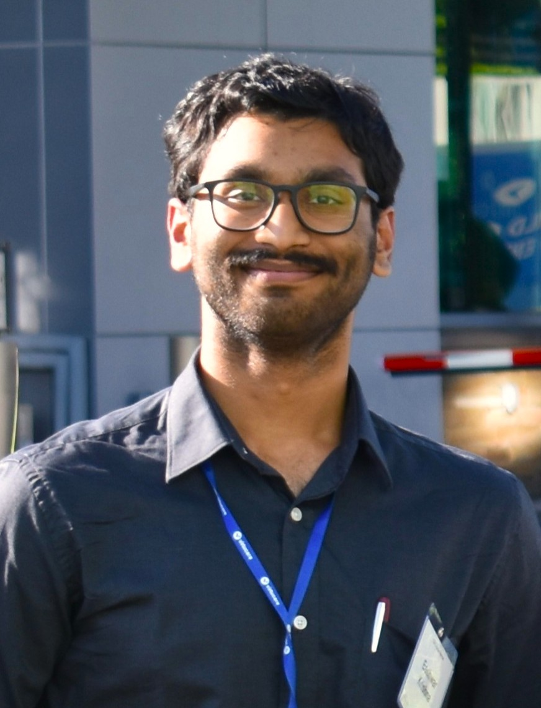

\
I am a future physician and public health researcher passionate about achieving health equity for rural and underserved populations preparing for entry into MD programs with a focus on health systems change. My work uses quantitative analysis and sociological frameworks to understand and address the social determinants of health. By engaging sociological theory in population health, I believe we can better expose barriers to equitable healthcare. Awarded the inaugural Rural Student Leader Award (2025) from the New England Rural Health Association. 

---

### Navigation

* [**Research Portfolio**](/research.md) 
* [**Professional Experience**](/experience.md)

### Connect and Contact

* [**View My ResearchGate Profile**](https://www.researchgate.net/profile/Eashwar-Krishna)
* [**Connect on LinkedIn**](https://www.linkedin.com/in/eashwar-krishna-39534520a/)
